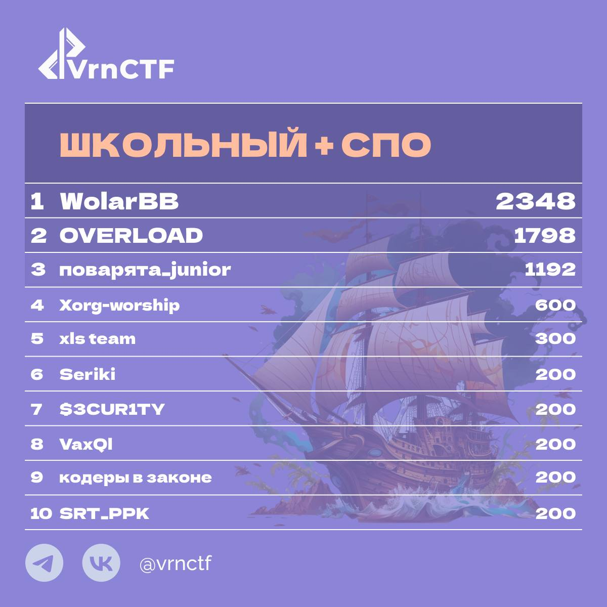
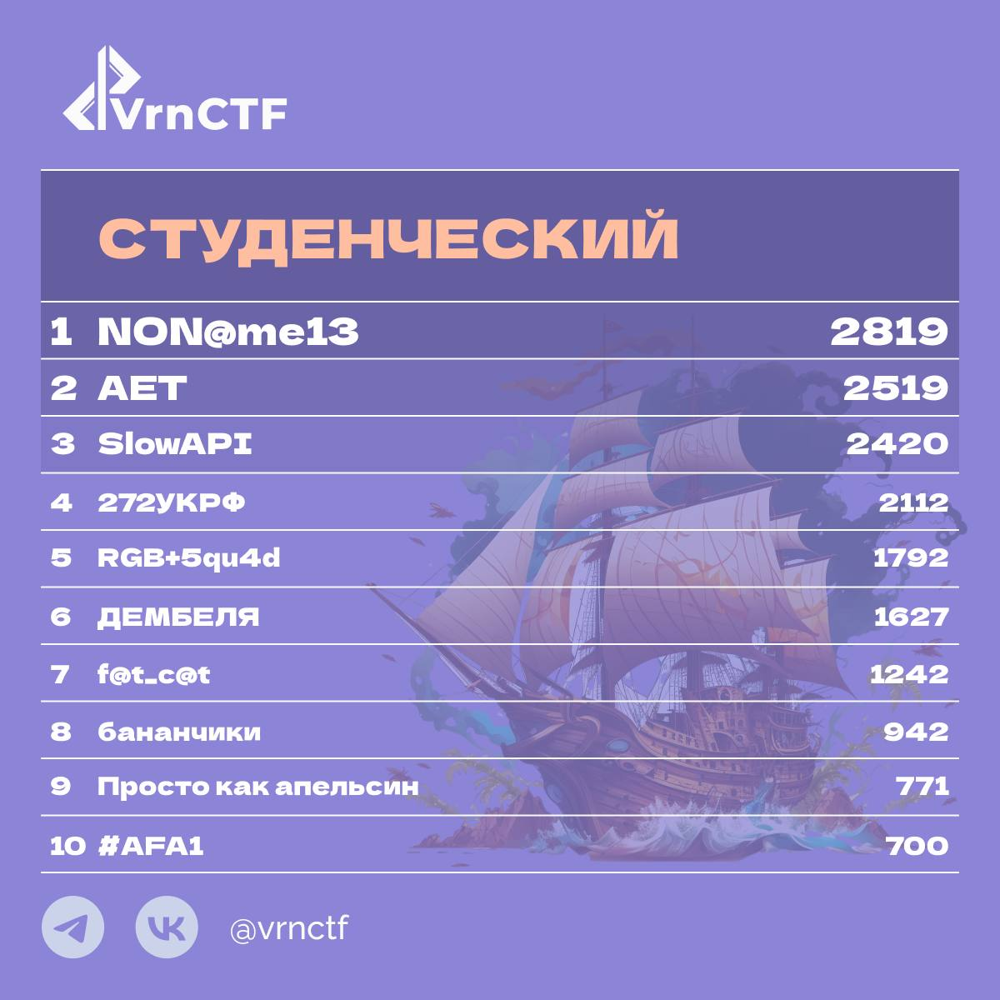
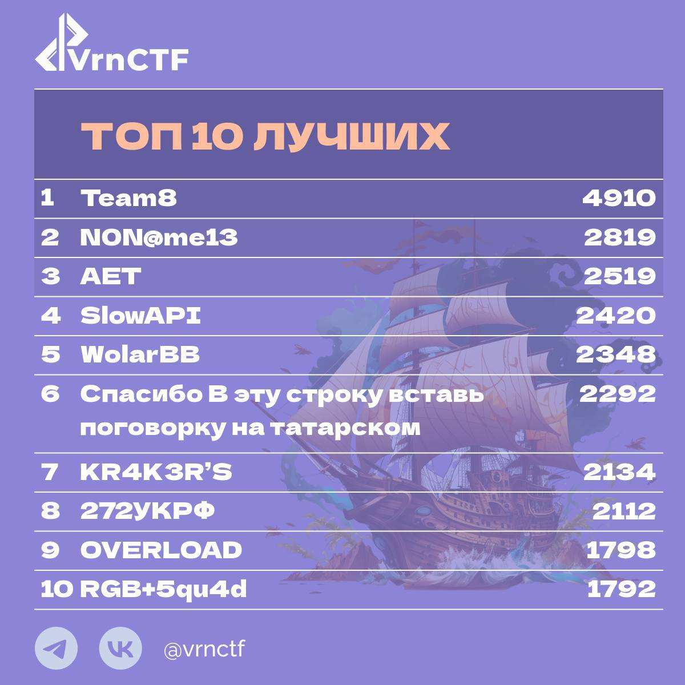

# Отборочный этап соревнований VRNCTF VII (в рамках чемпионата CyberCraft "Битва кодов")

Соревнования проходили 26 апреля в online-формате, а также на оффлайн-площадке Воронежского Государственного университета (Факультет компьютерных наук). В соревновании приняли участие 107 команд из различных регионов России. В результате было сформировано две лиги: "Школьники + учащиеся СПО" и "Студенты"

[Сайт соревнований](https://vrnctf.ru)  
[Caйт чемпионата](https://cybercraft.ru)

## Таблица прошедших в финал этапа "Школа+СПО"

## Таблица прошедших в финал этапа "Студенты"

## Топ-10 лучших участников
