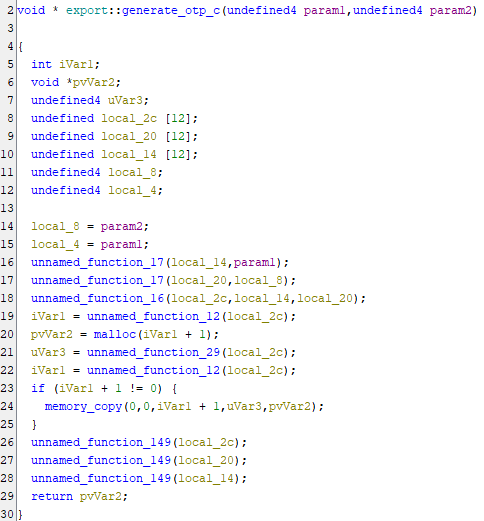
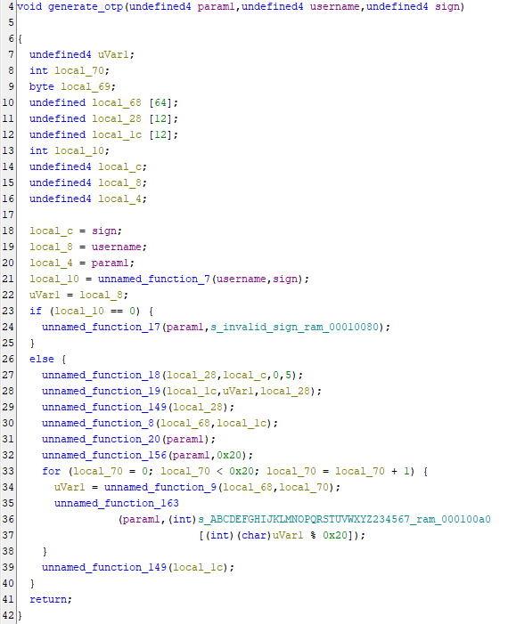
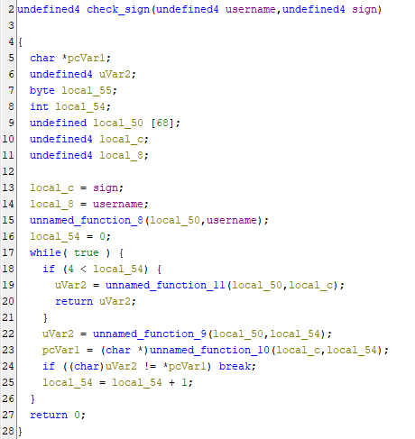
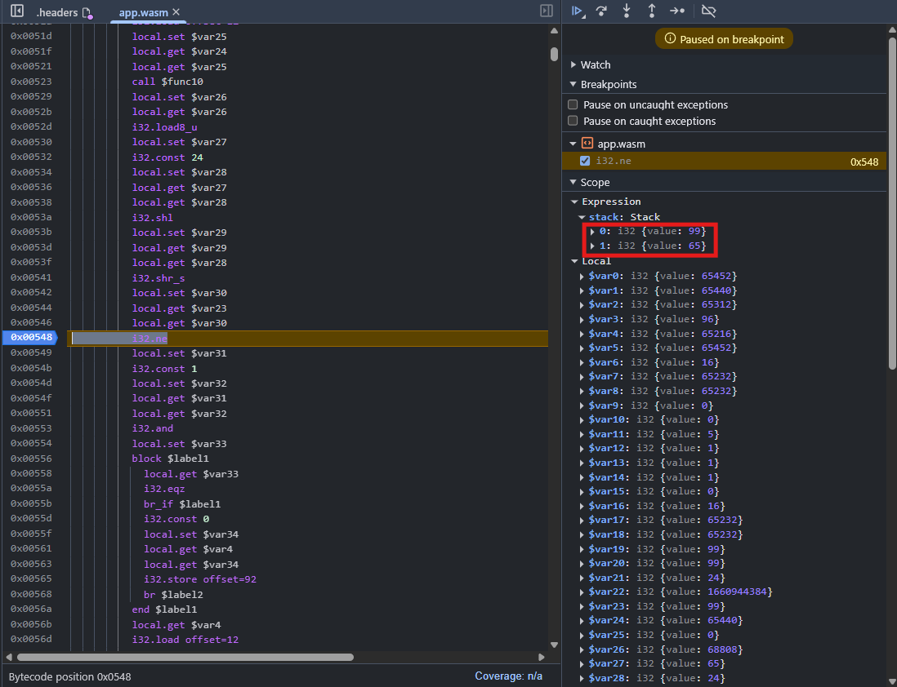
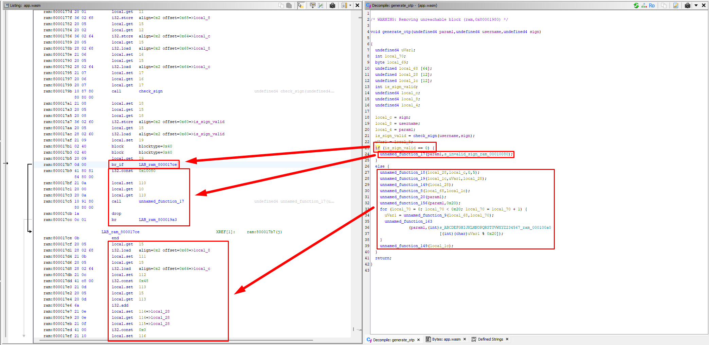
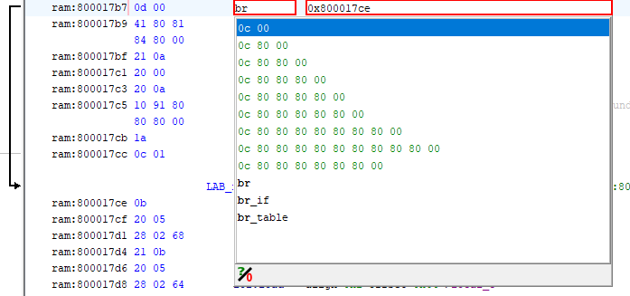
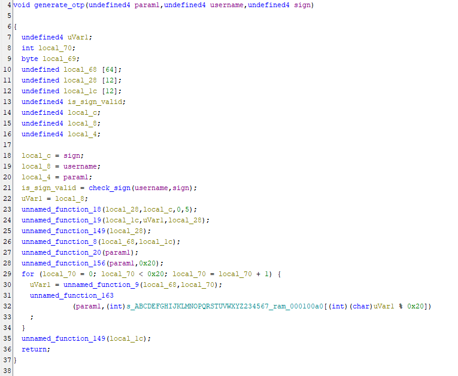

# Решение

При открытии сайта видим функционал регистрации и авторизации, причем авторизоваться можно имея только логин пользователя и его OTP.

В `app.js` упоминается страница `admin.html`, но при попытке открыть её получаем ошибку `{"detail":"Not authorized to access this resource"}`.

На странице профиля есть `secret_key` для генерации OTP кода, который можно импортировать в любое приложение генерации OTP, например Яндекс.Клюс или Google Authenticator.  
Нужно заметить, что ключ генерируется не на сервере, а на клиенте через WebAssembly. Значит можно попытаться получить ключ для чужого пользователя.

Генерация в коде выглядит так:
```javascript
const ptr = mod.ccall('generate_otp_c', 'number', ['string', 'string'], [respJsonString, signHeader]);
const otp = mod.UTF8ToString(ptr);
document.getElementById('secret-key-placeholder').textContent = otp;
```

Где `respJsonString` это тело ответа метода api `/me` формата
```json
{"username":"test@test.test"}
```
А `signHeader` — значение заголовка Sign из ответа API. Пример заголовка — `Sign: Ok88u5Dp93QAAXBvRB5N`.

Изучив значение этого заголовка на разных методах становится ясно, что он зависит от тела ответа. Таким образом подменить ответ метода `/me` недостаточно для генерации OTP любого пользователя.

Изучим вызываемую функцию `generate_otp_c` в wasm модуле `app.wasm`. Файлы `.wasm` содержат бинарный код с инструкциями, похожими на assembler. Откроем его в любом поддерживающем wasm дизассемблере, я буду использовать Ghidra.

Видим такую декомплированную функцию  


Изучив код понимаем, что это С обертка над основной функцией `unnamed_function_16`. Для удобства переименуем ее аргументы и название.  


Больше всего внимания цепляет функция `unnamed_function_7`, которая принимает имя пользователя и подпись из заголовка, а возвращает 0 или 1. В случае если она вернула 0, возвращается сообщение `invalid sign`, иначе генерируется OTP. Становится ясно, что это функция для проверки подписи. Переименуем ее в `check_sign`.

На строках 27 - 39 происходит генерация OTP, при этом в процессе используются только первые 5 символов подписи.

Перейдем к функции `check_sign`  


В коде функции видно цикл от 0 до 4. В нем идет сравнение первых 5 символов с симвовлами, которые возвращает функция `unnamed_function_10`. После этого вызывается функция `unnamed_function_11`, которая проверяет символы подписи с 6 по 20 и возвращает результат проверки.  
Для генерации OTP используются лишь первые 5 символов подписи, поэтому нас интересуют только они. Поскольку каждый из них последовательно проверяется в if, мы можем просто подсмотреть ожидаемые значения в дебаггере.

Подменим ответ запроса `/me` на следующий
```json
{"username":"admin"}
```

Поставим точку остановки на if с 24 строки в дебаггере Chrome. Для удобства заменим в ответе первый символ заголовка `Sign` на `A`.



Видим на стеке два значения - 99 и 65. Они соответствуют кодам ASCII символов `c` и `A` соответственно. Мы передали символ `A`, значит `c` это первый символ настоящей подписи. Заменим `A` на `c` в нашей подписи, чтобы дойти до второго символа.
Таким образом мы получаем первые 5 символов подписи - `cG0wA`. Но этого все еще недостаточно для генерации `secret_key`, наша подпись все еще не проходит проверку.

Давайте обойдем проверку подписи, инвертировав ее.
Нужно инвертировать if на 23 строке.  


Для этого заменим инструкцию `br_if` (условное ветвление) на `br` (безусловное ветвление). В соответствии с [документацией](https://developer.mozilla.org/en-US/docs/WebAssembly/Reference/Control_flow/br) необходимо заменить код инструкции с `0x0d` на `0x0c`.  


В итоге результат проверки подписи перестал использоваться, в чем можно удостовериться посмотрев на декомпилированный код.  


Теперь осталось сохранить измененный wasm модуль и использовать его вместо оригинального. Для этого можно воспользоваться функцией Override в Chrome.
Подменяем ответ сервера и получаем OTP, с помощью которого можно авторизоваться под пользователем `admin`. Входим в аккаунт, переходим на найденную выше страницу `admin.html` и получаем флаг.

Пропатченный модуль wasm лежит в этой папке под названием `app_patched.wasm`. Оригинальный код приложения можно найти в файле `main.cpp`.